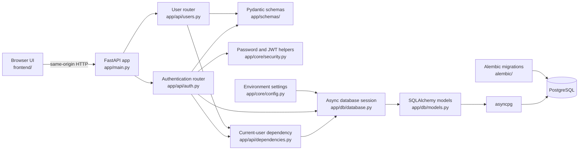
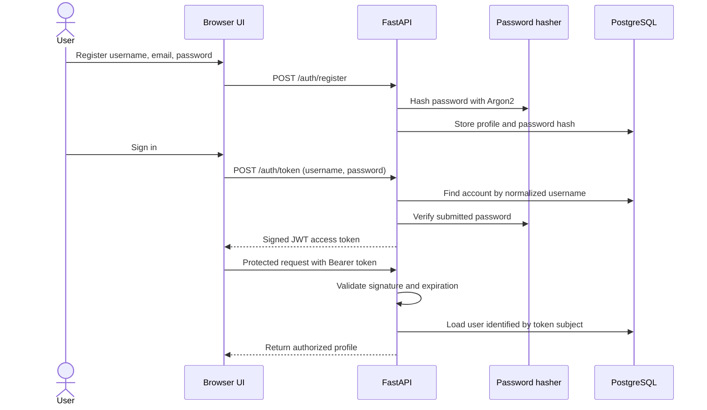

# Niramaya-AI

**A Python backend foundation for a healthcare-oriented AI project.**

Niramaya-AI is a learning-stage application built with FastAPI, asynchronous SQLAlchemy, and PostgreSQL. It includes a small authenticated user-profile workflow and a same-origin browser interface.

> **Current scope:** authentication, profile data, and database health checks are implemented. AI/ML inference, patient records, and clinical workflows are not. Do not enter real patient information or use this project to make clinical decisions.

## Contents

- [Project status](#project-status)
- [Features](#features)
- [Architecture](#architecture)
- [Technology stack](#technology-stack)
- [Repository layout](#repository-layout)
- [Quick start](#quick-start)
- [API reference](#api-reference)
- [Browser interface](#browser-interface)
- [Security and limitations](#security-and-limitations)
- [Roadmap](#roadmap)
- [Contributing](#contributing)
- [License](#license)


## Project status

This repository is a developer prototype. It demonstrates how a browser can call an asynchronous API, how the API can store users in PostgreSQL, and how bearer-token authentication can protect account data.

The project does not include an AI model, clinical decision support, patient data storage, or production operations. Its authentication is a foundation for learning and local development, not a complete identity platform.


## Features

- FastAPI application serves the API and the browser interface from one origin.
- Async database access uses SQLAlchemy's `AsyncSession` and the `asyncpg` PostgreSQL driver.
- Registration creates accounts with unique usernames and emails.
- Passwords are stored as Argon2 hashes.
- Login exchanges a username and password for a signed, expiring JWT access token.
- Protected endpoints resolve the token to a database user and limit profile reads to that user.
- Alembic tracks schema changes, including password hashes and usernames.
- A health endpoint checks whether PostgreSQL can be reached.


## Architecture

The application keeps its main responsibilities in separate layers:




### Authentication flow




### Request and data flow

The browser sends JSON or form-encoded requests to FastAPI. Pydantic validates request bodies, and route handlers call narrowly scoped security and database helpers. The current-user dependency validates bearer tokens using a fixed HS256 algorithm, reads the user ID from the token subject, and loads that account through a request-scoped async session.

SQLAlchemy maps the user model to PostgreSQL. The asyncpg driver handles database communication. Alembic applies versioned schema changes; the application does not run migrations automatically at startup.


## Technology stack

| Area | Technology |
| --- | --- |
| Runtime | Python 3.12+ |
| HTTP API | FastAPI, Uvicorn |
| Validation and configuration | Pydantic v2, pydantic-settings |
| Authentication | PyJWT, OAuth2 bearer tokens |
| Password hashing | pwdlib with Argon2 |
| ORM and sessions | SQLAlchemy 2.x async API |
| PostgreSQL driver | asyncpg |
| Schema migrations | Alembic |
| Browser interface | HTML, CSS, vanilla JavaScript |


## Repository layout

```text
app/
├── main.py                   # FastAPI app, routers, static UI, health endpoint
├── api/
│   ├── auth.py               # Registration, token, and current-user routes
│   ├── dependencies.py       # Bearer token validation and user resolution
│   └── users.py              # Authenticated profile route
├── core/
│   ├── config.py             # Environment-backed settings
│   ├── identifiers.py        # Username normalization
│   └── security.py           # Argon2 password and JWT helpers
├── db/
│   ├── database.py           # Async engine, session factory, request dependency
│   ├── init_db.py            # Local create_all helper
│   └── models.py             # SQLAlchemy user model
└── schemas/                  # Pydantic request and response contracts
alembic/
├── env.py                    # Migration environment using async settings
└── versions/                 # Versioned database changes
frontend/
├── index.html
├── styles.css
├── app.js
└── favicon.svg
.env.example                  # Safe local configuration template
requirements.txt
```


## Quick start

### Prerequisites

- Python 3.12 or newer.
- PostgreSQL running locally.
- A PostgreSQL role with permission to create and modify the application schema.
- Git and a terminal.

The commands below assume a local database named `niramaya` and a PostgreSQL role named `postgres`. Adjust them for your environment.


### Create a development database

If the database does not already exist, create it with:

```bash
createdb -h localhost -p 5432 -U postgres niramaya
```

You can also create the database using your preferred PostgreSQL administration tool. The application expects the database to be available before you apply migrations.


### Install dependencies

From the repository root, create and activate a virtual environment, then install the pinned dependencies:

```bash
python3.12 -m venv .venv
source .venv/bin/activate
python -m pip install --upgrade pip
python -m pip install -r requirements.txt
```

On Windows PowerShell, activate the environment with `.venv\Scripts\Activate.ps1`.

