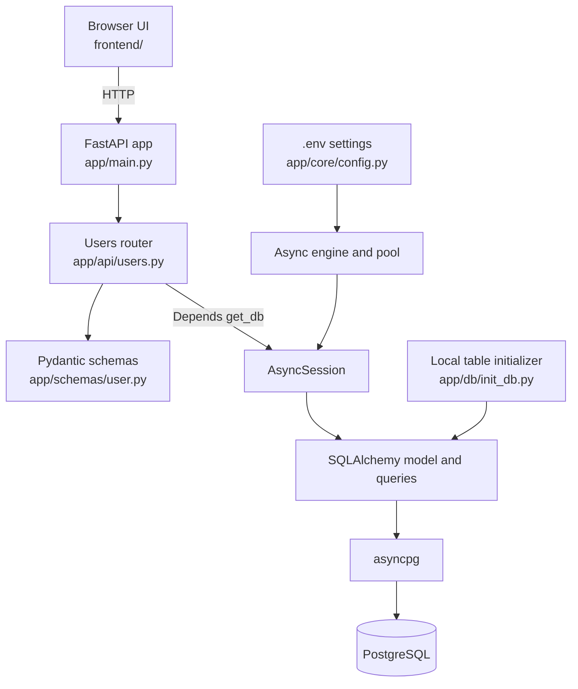

# Niramaya-AI

**An asynchronous FastAPI and PostgreSQL foundation for a healthcare-oriented AI project.**

Niramaya-AI is a learning-stage backend prototype built with Python 3.12+, FastAPI, SQLAlchemy's async API, asyncpg, and PostgreSQL. It currently demonstrates a small user-profile workflow and a browser interface on top of that API.

> **Project status:** this repository does not yet include an AI/ML model, authentication, patient records, or clinical functionality. It is not a medical product. Do not submit real patient information or use it to guide clinical decisions.

## What is implemented

- A FastAPI application with a same-origin HTML/CSS/JavaScript frontend.
- Async SQLAlchemy database access using `AsyncSession` and the `asyncpg` driver.
- A `users` table with an integer ID, name, unique email, and server-generated creation time.
- User creation and lookup endpoints, with duplicate and missing-user responses.
- A database-aware health endpoint and an explicit local table-initialization command.

## Architecture

The frontend calls the FastAPI routes. FastAPI validates request and response data with Pydantic; dependency injection supplies one async database session for the request. SQLAlchemy maps Python objects and queries to database operations, while asyncpg carries PostgreSQL protocol traffic to the database.

## Technology

| Area | Technology |
| --- | --- |
| Runtime | Python 3.12+ |
| API | FastAPI, Uvicorn |
| Validation and settings | Pydantic v2, pydantic-settings |
| Database layer | SQLAlchemy 2.x async API, `AsyncSession` |
| PostgreSQL driver | asyncpg |
| Database | PostgreSQL |
| Browser interface | HTML, CSS, vanilla JavaScript |
